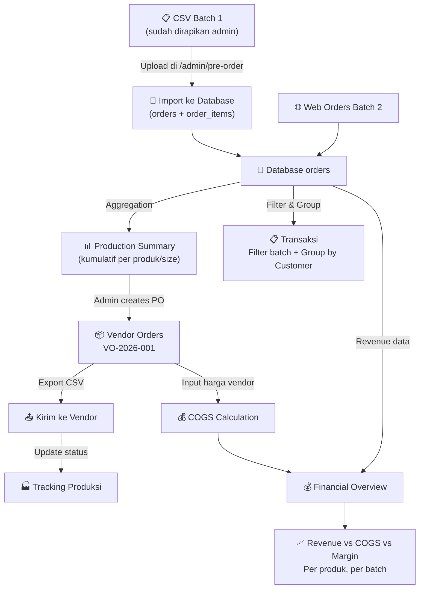

# Import Data PO Batch 1 + Fitur Vendoring (v4 — Revised)

## Latar Belakang

FILKOM Merch sudah menjalankan PO Batch 2 melalui web. PO Batch 1 sebelumnya via Google Form. Data Batch 1 akan dirapikan oleh admin sendiri ke format CSV yang **sama persis** dengan export CSV Batch 2, sehingga **tidak perlu parser custom** — cukup import CSV standar.

Harga jual Batch 1 dan Batch 2 **berbeda** per produk, sehingga perlu fitur set harga jual per batch. Vendor **berbeda-beda per produk**.

### Revisi dari v3

> [!IMPORTANT]
> - **Import CSV tidak perlu halaman khusus baru**. Import ditaruh langsung di halaman Pre-Order yang sudah ada (`/admin/pre-order`). Admin membuat campaign "Batch 1", lalu upload CSV di situ.
> - **Halaman Transaksi (`/admin/transactions`) ditambah filter batch**: Batch 1, Batch 2, Ready Stock, atau Semua.
> - **Mode "Group by Customer"**: Jika satu orang (misal "Fifi") melakukan transaksi di Batch 1 dan Batch 2, pesanannya bisa digabung 1 baris. Tetapi tetap bisa toggle ke tampilan transaksi terpisah (per-transaksi individual).

### Temuan dari Investigasi Kode

> [!NOTE]
> Setelah investigasi kode:
> - `products.pre_order_campaign_id` **sudah ada** di migrasi (`migrate.ts` baris 114-115). Kolom ini menghubungkan produk dengan batch PO.
> - `orders.pre_order_campaign_id` **belum ada**. Perlu ditambahkan agar setiap pesanan bisa difilter per batch.
> - `orders.batch_source` **belum ada**. Perlu ditambahkan untuk membedakan asal data: `web`, `csv_import`, `manual`.
> - `getOnlineOrders` (backend) menggunakan `SELECT * FROM orders WHERE channel = 'online'`. Begitu kolom baru ditambahkan, otomatis ikut ter-return tanpa perlu ubah query.
> - Export CSV di `pre-order.tsx` (baris 182-229) sudah ada dengan format 10 kolom. Import CSV harus bisa menerima format yang sama.

---

## Proposed Changes

### Phase A: Database Schema Changes

#### [MODIFY] [migrate.ts](file:///c:/Users/rizwa/OneDrive/Gambar/web/filkommerch/web_filkom_merch/backend/src/migrate.ts)

> [!NOTE]
> ✅ **SUDAH DIKERJAKAN** — Migrasi sudah ditambahkan di `migrate.ts`. Tabel akan otomatis dibuat saat backend restart.

##### Tabel `vendors` ✅
```sql
CREATE TABLE IF NOT EXISTS vendors (
  id INT AUTO_INCREMENT PRIMARY KEY,
  name VARCHAR(150) NOT NULL,
  contact_person VARCHAR(100),
  phone VARCHAR(20),
  email VARCHAR(100),
  notes TEXT,
  is_active TINYINT(1) DEFAULT 1,
  created_at TIMESTAMP DEFAULT CURRENT_TIMESTAMP,
  updated_at TIMESTAMP DEFAULT CURRENT_TIMESTAMP ON UPDATE CURRENT_TIMESTAMP
);
```

##### Tabel `vendor_orders` (PO ke vendor) ✅
```sql
CREATE TABLE IF NOT EXISTS vendor_orders (
  id INT AUTO_INCREMENT PRIMARY KEY,
  po_number VARCHAR(50) NOT NULL UNIQUE,     -- Format: VO-2026-001
  vendor_id INT NOT NULL,
  status ENUM('draft','sent','in_production','completed','cancelled') DEFAULT 'draft',
  total_cost INT DEFAULT 0,
  notes TEXT,
  deadline DATE DEFAULT NULL,
  sent_at TIMESTAMP NULL,
  completed_at TIMESTAMP NULL,
  created_at TIMESTAMP DEFAULT CURRENT_TIMESTAMP,
  updated_at TIMESTAMP DEFAULT CURRENT_TIMESTAMP ON UPDATE CURRENT_TIMESTAMP,
  FOREIGN KEY (vendor_id) REFERENCES vendors(id) ON DELETE CASCADE
);
```

##### Tabel `vendor_order_items` (Detail item per PO vendor) ✅
```sql
CREATE TABLE IF NOT EXISTS vendor_order_items (
  id INT AUTO_INCREMENT PRIMARY KEY,
  vendor_order_id INT NOT NULL,
  product_id INT NOT NULL,
  size VARCHAR(30) DEFAULT NULL,
  color VARCHAR(50) DEFAULT NULL,
  quantity INT NOT NULL,
  unit_cost INT NOT NULL DEFAULT 0,          -- Harga satuan dari vendor
  subtotal_cost INT NOT NULL DEFAULT 0,      -- qty × unit_cost
  notes TEXT,
  FOREIGN KEY (vendor_order_id) REFERENCES vendor_orders(id) ON DELETE CASCADE,
  FOREIGN KEY (product_id) REFERENCES products(id) ON DELETE CASCADE
);
```

##### Tabel `batch_product_prices` (Harga jual per batch per produk) ✅
Karena harga Batch 1 ≠ Batch 2, perlu tabel terpisah:
```sql
CREATE TABLE IF NOT EXISTS batch_product_prices (
  id INT AUTO_INCREMENT PRIMARY KEY,
  campaign_id INT NOT NULL,
  product_id INT NOT NULL,
  selling_price INT NOT NULL,                -- Harga jual ke customer di batch ini
  filkom_price INT DEFAULT NULL,             -- Harga khusus civitas (jika beda)
  FOREIGN KEY (campaign_id) REFERENCES pre_order_campaigns(id) ON DELETE CASCADE,
  FOREIGN KEY (product_id) REFERENCES products(id) ON DELETE CASCADE,
  UNIQUE KEY unique_batch_product (campaign_id, product_id)
);
```

##### Kolom tambahan di `orders` ✅
```sql
ALTER TABLE orders ADD COLUMN batch_source ENUM('web','csv_import','manual') DEFAULT 'web';
ALTER TABLE orders ADD COLUMN pre_order_campaign_id INT DEFAULT NULL;
```

##### Kolom tambahan di `products` ✅
```sql
ALTER TABLE products ADD COLUMN vendor_cost INT DEFAULT 0;  -- Default COGS per unit
```

---

### Phase B: Import CSV Batch 1 (Terintegrasi di Halaman Pre-Order)

**Tidak ada halaman baru.** Import CSV ditaruh langsung di halaman admin Pre-Order yang sudah ada.

#### Alur kerja admin:
1. Buka `/admin/pre-order` → klik **"+ Buat Batch Baru"** → buat campaign bernama "PO Batch 1" dengan tanggal mulai & selesai sesuai periode Batch 1 yang lalu.
2. Pada kartu/card campaign "PO Batch 1", tersedia tombol **"📤 Import CSV"** (di sebelah tombol Statistik & Export CSV yang sudah ada).
3. Klik tombol tersebut → muncul modal dialog:
   - **Upload CSV** — drag & drop atau file picker
   - **Preview tabel** — tampilkan data yang akan di-import
   - **Konfirmasi Import** — klik tombol, data masuk ke `orders` + `order_items` dengan:
     - `batch_source = 'csv_import'`
     - `transaction_status = 'settlement'` (Batch 1 sudah lunas semua)
     - `payment_status = 'paid'`
     - `pre_order_campaign_id` = ID campaign Batch 1

#### [MODIFY] [pre-order.tsx](file:///c:/Users/rizwa/OneDrive/Gambar/web/filkommerch/web_filkom_merch/frontend/src/routes/admin/pre-order.tsx)

Perubahan:
- Tambah tombol **"📤 Import CSV"** pada setiap card campaign
- Tambah state & modal dialog untuk upload CSV, preview tabel, dan konfirmasi import
- Setelah import sukses, invalidate query stats

#### Format CSV yang diharapkan (10 kolom — sama persis dengan export CSV existing):

| No Order | Tanggal Order | Nama Pembeli | Email Pembeli | No HP Pembeli | NIM Pembeli | Rincian Produk (Item / Size / Qty) | Status Pembayaran | Status Pesanan | Total Bayar (Rp) |
|----------|---------------|--------------|---------------|---------------|-------------|-------------------------------------|-------------------|----------------|-------------------|

> [!NOTE]
> Untuk Batch 1, kolom "Status Pembayaran" bisa diisi `settlement` dan "Status Pesanan" bisa diisi `completed` karena sudah lunas semua. Jika dikosongkan, sistem default ke `settlement`/`completed`.

Format kolom "Rincian Produk": `NamaProduk [Size/Variant] (xQty) | NamaProduk2 [Size/Variant] (xQty)`

#### Backend Endpoint

```
POST /api/admin/import/orders
```
Body: `{ campaignId: number, rows: ParsedRow[] }`

#### [MODIFY] [api.ts](file:///c:/Users/rizwa/OneDrive/Gambar/web/filkommerch/web_filkom_merch/backend/src/controllers/api.ts)
Tambah function `importOrders` — menerima array data pesanan, insert ke `orders` + `order_items` dengan `batch_source = 'csv_import'` dan `pre_order_campaign_id`.

#### [MODIFY] [server.ts](file:///c:/Users/rizwa/OneDrive/Gambar/web/filkommerch/web_filkom_merch/backend/src/server.ts)
Register route `POST /api/admin/import/orders` dengan `checkRole(['admin'])`.

#### [MODIFY] [server-actions.ts](file:///c:/Users/rizwa/OneDrive/Gambar/web/filkommerch/web_filkom_merch/frontend/src/backend/server-actions.ts)
Tambah server action `importOrdersServerAction`.

---

### Phase C: Fitur Vendoring (Admin Panel)

#### [NEW] [vendoring.tsx](file:///c:/Users/rizwa/OneDrive/Gambar/web/filkommerch/web_filkom_merch/frontend/src/routes/admin/vendoring.tsx)

Halaman admin `/admin/vendoring` dengan **4 tab**:

##### Tab 1: 📊 Production Summary

Aggregasi seluruh pesanan pre-order yang perlu diproduksi:

| Produk | Size/Variant | Batch 1 | Batch 2 | **Total** | Assigned Vendor |
|--------|-------------|---------|---------|-----------|-----------------|
| Work Jacket | S | - | 8 | 8 | Vendor A |
| Work Jacket | M | - | 15 | 15 | Vendor A |
| Enamel TI | All Size | 15 | 8 | 23 | Vendor B |
| Keychain D1 | All Size | 10 | 5 | 15 | Vendor C |

- Filter by batch, product, vendor
- Summary cards: Total produk, Total unit, Est. COGS, Est. margin

##### Tab 2: 🏭 Vendors

CRUD vendor: Nama, Contact Person, No HP, Email, Notes.
Setiap vendor card menampilkan list produk yang di-assign + total value PO.

##### Tab 3: 📦 Vendor Orders

Buat & kelola Purchase Order ke vendor:
- **Create PO**: Pilih vendor → Pilih items (auto-filled dari production summary) → Input harga vendor per unit → Set deadline → Generate PO number (VO-2026-XXX)
- **Status Tracking**: `Draft` → `Sent to Vendor` → `In Production` → `Completed`
- **Per PO**: daftar items, unit cost, subtotal, total COGS
- Export PO sebagai CSV

##### Tab 4: 💰 Financial Overview

| Metric | Value |
|--------|-------|
| Total Revenue (semua batch) | Rp XX.XXX.XXX |
| Total COGS (semua vendor PO) | Rp XX.XXX.XXX |
| **Gross Margin** | **Rp XX.XXX.XXX** |
| **Margin %** | **XX%** |

Breakdown per produk:

| Produk | Qty Sold | Avg Selling Price | Revenue | COGS/unit | Total COGS | Margin | Margin % |
|--------|----------|-------------------|---------|-----------|------------|--------|----------|

- Filter per batch
- Export financial report CSV

#### Backend Endpoints (Phase C)

```
# Vendor CRUD
GET    /api/admin/vendors
POST   /api/admin/vendors
PUT    /api/admin/vendors/:id
DELETE /api/admin/vendors/:id

# Production Summary
GET    /api/admin/vendoring/summary?batch=all|1|2

# Vendor Orders
GET    /api/admin/vendoring/orders
POST   /api/admin/vendoring/orders
GET    /api/admin/vendoring/orders/:id
PUT    /api/admin/vendoring/orders/:id
PUT    /api/admin/vendoring/orders/:id/status
DELETE /api/admin/vendoring/orders/:id
GET    /api/admin/vendoring/orders/:id/export

# Financial
GET    /api/admin/vendoring/financials?batch=all|1|2
```

#### [MODIFY] [server.ts](file:///c:/Users/rizwa/OneDrive/Gambar/web/filkommerch/web_filkom_merch/backend/src/server.ts)
Register semua route vendor baru, `checkRole(['admin'])`.

#### [MODIFY] [server-actions.ts](file:///c:/Users/rizwa/OneDrive/Gambar/web/filkommerch/web_filkom_merch/frontend/src/backend/server-actions.ts)
Tambah TypeScript interfaces (`Vendor`, `VendorOrder`, `VendorOrderItem`) dan server actions untuk semua endpoint vendor.

#### [MODIFY] [route.tsx](file:///c:/Users/rizwa/OneDrive/Gambar/web/filkommerch/web_filkom_merch/frontend/src/routes/admin/route.tsx)
Tambah navigasi "Vendoring" di sidebar admin.

---

### Phase D: Harga Jual per Batch

#### [MODIFY] [pre-order.tsx (admin)](file:///c:/Users/rizwa/OneDrive/Gambar/web/filkommerch/web_filkom_merch/frontend/src/routes/admin/pre-order.tsx)

Tambahkan section di halaman admin Pre-Order untuk **set harga jual per produk per batch**:
- Ketika admin membuat/mengedit campaign, ada tabel produk-produk yang terkait + input harga jualnya
- Data disimpan di `batch_product_prices`
- Harga ini digunakan di financial overview untuk menghitung revenue per batch

#### Backend Endpoints (Phase D)

```
GET    /api/admin/batch-prices/:campaignId
POST   /api/admin/batch-prices/:campaignId
```

---

### Phase E: Filter Batch & Group by Customer di Transaksi

#### [MODIFY] [transactions.tsx](file:///c:/Users/rizwa/OneDrive/Gambar/web/filkommerch/web_filkom_merch/frontend/src/routes/admin/transactions.tsx)

##### E1. Filter Batch

Tambahkan **dropdown / chip filter sumber batch** di area filter (dekat search bar):

- **Semua** — tampilkan semua transaksi (default)
- **Batch 1** — hanya transaksi dengan `pre_order_campaign_id` = ID Batch 1
- **Batch 2** — hanya transaksi dengan `pre_order_campaign_id` = ID Batch 2
- **Ready Stock** — transaksi yang bukan pre-order (`pre_order_campaign_id` IS NULL)

> [!NOTE]
> `getOnlineOrders` backend menggunakan `SELECT * FROM orders`, jadi kolom `pre_order_campaign_id` dan `batch_source` otomatis ikut ter-return begitu kolom dibuat di database. **Tidak perlu ubah query backend.**

Daftar batch campaign diambil dari server action `getPreOrderCampaignsServerAction` yang sudah ada. Stat cards (Total, Lunas, Verifying, DP, Belum Bayar) ikut ter-filter sesuai batch.

##### E2. Mode "Group by Customer"

Tambahkan **toggle switch** di atas tabel transaksi:

```
[ ] Gabungkan pesanan per nama pembeli
```

**Saat OFF (default)**: Tampilan normal — setiap transaksi = 1 baris.

**Saat ON**: Transaksi di-*group* berdasarkan `customer_name` (case-insensitive, trimmed). Satu baris per nama pembeli:

| Nama Pembeli | Jumlah Transaksi | Batch | Total Item | Total Bayar | Status |
|---|---|---|---|---|---|
| Fifi | 2 | Batch 1, Batch 2 | 5 item | Rp 450.000 | ✅ Semua Lunas |
| Budi | 1 | Batch 2 | 2 item | Rp 120.000 | ⏳ Belum Bayar |

Klik baris → expand accordion menampilkan detail tiap transaksi individual (order ID, tanggal, rincian produk, status masing-masing).

> [!NOTE]
> Pencocokan nama menggunakan `customer_name.trim().toLowerCase()`. Di masa depan bisa ditingkatkan ke pencocokan email/NIM jika tersedia.

---

## Alur Kerja



---

## Urutan Implementasi

| # | Task | File Changes | Status |
|---|------|-------------|--------|
| 1 | Database migration (vendors, vendor_orders, vendor_order_items, batch_product_prices, kolom baru) | `migrate.ts` | ✅ Done |
| 2 | Backend: Import CSV endpoint + return `pre_order_campaign_id` di admin orders | `api.ts`, `server.ts` | |
| 3 | Frontend: Tombol Import CSV + modal preview di halaman Pre-Order | `pre-order.tsx` | |
| 4 | Backend: Vendor CRUD API | `api.ts`, `server.ts` | |
| 5 | Backend: Production Summary + Vendor Orders API | `api.ts`, `server.ts` | |
| 6 | Frontend: Vendoring page — Production Summary tab | `vendoring.tsx` (NEW) | |
| 7 | Frontend: Vendoring page — Vendors tab | `vendoring.tsx` | |
| 8 | Frontend: Vendoring page — Vendor Orders tab | `vendoring.tsx` | |
| 9 | Backend + Frontend: Financial calculations & overview | `api.ts`, `vendoring.tsx` | |
| 10 | Backend + Frontend: Batch product prices | `api.ts`, `pre-order.tsx` | |
| 11 | Frontend: Filter batch + Group by Customer di Transaksi | `transactions.tsx` | |

---

## Verification Plan

### Manual Verification
- Restart backend → cek tabel `vendors`, `vendor_orders`, `vendor_order_items`, `batch_product_prices` terbuat di database
- Upload CSV Batch 1 **dari halaman Pre-Order**, verify data imported correctly
- Cek production summary menampilkan kumulatif Batch 1 + 2
- CRUD vendor, create PO, verify total COGS
- Financial overview: revenue dari order_items, COGS dari vendor_order_items, margin = revenue - COGS
- Export CSV untuk vendor
- **Filter batch di Transaksi**: pilih "Batch 1" → hanya transaksi Batch 1 tampil, stat cards ikut berubah
- **Group by Customer**: toggle ON → "Fifi" yang beli di Batch 1 & 2 tampil 1 baris, expand untuk lihat detail per transaksi
- **Toggle OFF kembali** → semua transaksi tampil terpisah seperti biasa
